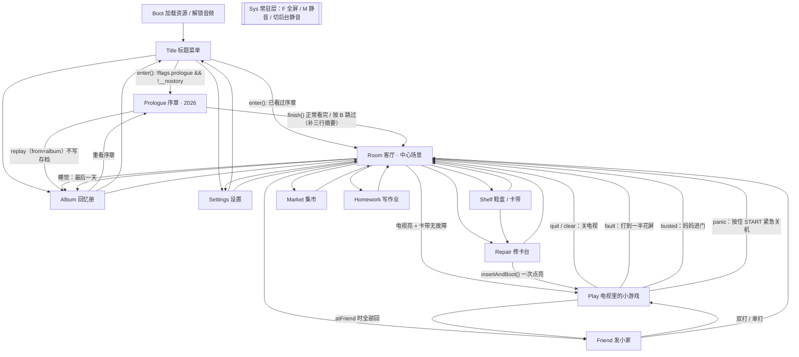

# 那年的红白机 — 工程与架构说明

> 与代码同步于：2026-09-21，save VER=4，Phaser 3.60

这份文档回答一个问题：**你要改这个工程里的某个东西，该从哪儿下手、不能碰什么。**
所有函数签名与字段名请配合 [API.md](API.md) 查；美术/音频/字体规格见 [ART_MANIFEST.md](ART_MANIFEST.md)、[AUDIO_SPEC.md](AUDIO_SPEC.md)、[FONT_SPEC.md](FONT_SPEC.md)、[PALETTE.md](PALETTE.md)；玩法定义见 [PRD.md](PRD.md) 与 [prd_src/](prd_src/)。

---

## 1. 三十秒版

- **纯静态站点**。没有 npm、没有 bundler、没有模块系统。`index.html` 按顺序 `<script>` 引入所有源文件，浏览器直接跑。
- **Phaser 3.60**，本地 `vendor/phaser.min.js`，不连 CDN。
- **ES5 写法**：`var`、函数表达式、`Phaser.Class`、原型继承。每个文件是一个 IIFE，往 `window.SB` 上挂东西。
- **逻辑分辨率固定 480×270**，`pixelArt: true` + `roundPixels: true` + `Scale.FIT` 整数放大。电视画面区是中间的 **360×270**（`SB.SCREEN`），左右各 60px 是木框。
- **存档只有 localStorage 一处**，键 `nianhong_save_v1`（改名前是 `subor_summer_save_v1`，第一次读档时自动搬过来，老键不删），当前 `SB.Save.VER = 4`。
- 叙事分两层：**现实层 2026**（序章，深夜加班后在出租车上睡着）和**梦境层 2004**（正片，小学暑假 48 天）。

改代码的三条底线：

1. 新增 JS 文件 → 必须自己去 `index.html` 里按依赖顺序加一行 `<script>`，否则永远不会被加载。
2. 不要引入 `import` / `export` / `let` / `const` / 箭头函数 / 模板字符串以外的现代语法习惯——全工程是 ES5 风格，混写会让 diff 一眼看出来不属于这里（且 `test-game.html` 这类裸页面也依赖同样的加载假设）。
3. 存档键与 `VER` 的升级方式见 §7，写错等于线上老玩家的档全丢。

---

## 2. 目录结构

```
index.html              入口：全局命名空间 + 按依赖顺序引入全部脚本 + 载入遮罩/致命错误面板
vendor/phaser.min.js    Phaser 3.60（本地）
src/main.js             Phaser.Game 配置、场景注册表、READY 后启动常驻 Sys 场景
src/core/               不含玩法的地基
  const.js              分辨率、布局坐标、层级 SB.D、调色板 SB.C、故障表 SB.FAULT、时段 SB.SLOTS、小工具
  save.js               存档 schema / 读写 / 迁移
  audio.js              SB.Audio（manifest 驱动）+ SB.Mic（麦克风哈气）
  input.js              SB.Input（键盘/手柄/触屏 → 红白机 8 键）+ SB.TouchPad
  text.js               SB.Text（点阵中文、测量、折行、打字机）
  ui.js                 SB.UI（面板/按钮/对话框/菜单/提示条/状态栏/焦点框/转场/过场）
  crt.js                SB.CRT（显像管特效、开关机、故障、全屏木框）
  keyguide.js           SB.KeyGuide（电视画面里的按键卡与常驻键位条）
src/systems/            玩法规则（只算数，不画画）
  timeSystem.js         SB.Time：日期、时段、精力、睡觉、日常事件
  economy.js            SB.Econ：卡带/杂货价格、砍价、成交
  repair.js             SB.Repair：脏污/磨损、开机失败率、故障类型、五种修法
  parent.js             SB.Parent：妈妈的秒表、三级警告、进门清算
  rescue.js             SB.Rescue：听见动静之后的「抢救三下」判定规则（纯规则，不碰 Phaser）
  story.js              SB.Story：心情、账本、目标、章节、结局变体
  chore.js              SB.Chore：主动干活的规矩与账（能不能干/干了几次/谁给钱）
src/games/              小游戏
  GameBase.js           SB.GameBase 基类 + SB.extendGame()
  ContraGame.js TankGame.js MarioGame.js FightGame.js   四个完整小游戏
  StubGame.js           stub/null/multi/garble/crash 五种"盗版卡演出"
src/anim/
  repairAnim.js         SB.RepairAnim：哈气/划桌动作特写（纯表现层）
  payAnim.js            SB.PayAnim：收钱全屏特写（纯表现层，记账在 onDone 的调用方）
  prologueArt.js        SB.PROLOGUE_PAINT：序章 11 张画面的画法
src/data/               纯数据，不含逻辑
  assets.js             SB.ASSETS 资源清单
  cartridges.js         SB.CARTS / SB.GOODS / SB.MULTI_MENU
  chores.js             SB.CHORES 家务表 / SB.PAYERS 付款方 / SB.PAY_BY_SRC 来源映射
  story.js              SB.STORY 剧情结构与常量（含序章 12 个分镜）
  lines.js              SB.L 主文案树 + SB.line()
  storyLines.js         SB.L.story 剧情/序章/结局文案
src/scenes/             13 个场景，见 §5
assets/                 img / audio / font，全部由 tools/gen_*.py 生成
tools/                  资源生成脚本、build_dist.sh、gametest/（Playwright 回归）
docs/                   本文档与各类规格
dist/ dist_pack/        构建产物，不入库
test-game.html          单个小游戏的调试页（不初始化完整 SB，只用来看画面）
```

---

## 3. 加载顺序（`index.html`）

顺序不是随便排的，它就是这个工程的依赖图：

```
1. vendor/phaser.min.js
2. 数据与常量   core/const.js → data/assets.js → data/cartridges.js
                data/lines.js → data/story.js → data/storyLines.js → data/chores.js
3. 核心系统     core/save.js → core/audio.js → core/input.js
                core/text.js → core/ui.js → core/crt.js
4. 玩法系统     systems/timeSystem.js → economy.js → repair.js → parent.js → rescue.js → story.js → chore.js
5. 小游戏       games/GameBase.js → Contra → Tank → Mario → Fight → Stub
6. core/keyguide.js        ← 必须在小游戏之后
7. 动作特写     anim/repairAnim.js → anim/payAnim.js → anim/prologueArt.js
8. 场景         Sys → Boot → Title → Prologue → Room → Repair → Shelf
                → Market → Friend → Homework → Play → Settings → Album
9. src/main.js
```

几条必须记住的约束：

- `window.SB = { version: '1.0.0' }` 是在 `index.html` 内联 `<script>` 里建的，所以任何源文件都能直接 `(function (SB) { ... })(window.SB)`。
- **`keyguide.js` 必须排在 `src/games/*` 之后**：它靠 `game instanceof SB.Games.contra` 这类判断来识别当前跑的是哪张卡的玩法（`SB.KeyGuide.modeOf()`），构造器还没注册它就认不出来。
- `const.js` 必须最先：`SB.C`、`SB.D`、`SB.W/H` 在其它文件的顶层就被读走（例如 `prologueArt.js` 的 `ART = { w: SB.W }`）。
- `save.js` 的 `def()` 会遍历 `SB.CARTS`，所以 `data/cartridges.js` 要在它之前。
- 场景文件之间没有互相依赖（都只在运行时 `scene.start()`），但都必须在 `main.js` 之前——`main.js` 会检查场景数组里有没有 `undefined`，缺了会在页面上打出「请检查 index.html 的脚本顺序」。

---

## 4. 启动流程

`src/main.js`：

1. `window.load` 时先确认 `Phaser` 存在（否则在 `#fatal` 面板上报错退出）。
2. `SB.Audio.fetchManifest()` 先把 `assets/audio/manifest.json` 拉下来——**成功和失败都走同一个 `start()`**，拉不到就整局静音开玩。
3. `SB.Save.load()`（含 `merge` 补字段 + `migrate` 补语义）。
4. `new Phaser.Game(cfg)`：`width/height = SB.W/SB.H`、`pixelArt`、`roundPixels`、`antialias: false`、`Scale.FIT` + `CENTER_BOTH`、`input.activePointers: 4`。
5. `Phaser.Core.Events.READY` 之后 `scene.start('Sys')`，把常驻系统层拉起来。

`BootScene`：

- 加载点阵字体 `pix12`/`pix16`、`SB.ASSETS.images`、`SB.ASSETS.sheets`，并 `SB.Audio.queue(this.load)` 把音频排进队列。
- `loaderror` 一律登记到 `SB.MISSING[key] = true`，**不阻塞**。缺图后面用色块/运行时纹理兜底，缺音静默。
- 运行时现画三张一定要有的纹理：`px`（1×1 白点）、`snow`（雪花）、`scanline`。
- `SB.Audio.init(game)` / `SB.Input.init(game)` / `SB.Parent.init()`。
- 浏览器音频没解锁时显示 `#tapstart`「点击开机」，等 `Phaser.Sound.Events.UNLOCKED`；有些环境不派发该事件，所以有一个 4 秒超时兜底，然后 `scene.start('Title')`。

---

## 5. 场景流转

13 个场景，键名就是 `scene.start()` 用的字符串：`Boot / Title / Prologue / Room / Shelf / Repair / Play / Market / Friend / Homework / Settings / Album / Sys`。



**换场景一律走 `SB.UI.go(scene, key, data)`**（淡出 260ms 再 `scene.start`）。它用 `scene.__going` 上锁并在 `shutdown` 时解锁，防止一次点击触发两次跳转。少数需要"先播完过场再走"的地方才直接用 `scene.scene.start()`（`TitleScene.enter()`、`RoomScene.sleep()`、`PlayScene.exit()` 等），这些地方自己管好了状态，不要顺手改成 `SB.UI.go()`。

### 各场景职责与进场参数

| 场景 | 职责 | `init(data)` 读的字段 |
|---|---|---|
| `Boot` | 加载资源、登记缺失、解锁音频、初始化 Audio/Input/Parent | — |
| `Title` | 标题、存档摘要、继续/重开/回忆册/设置；**序章门禁唯一入口**；死屏兜底 | — |
| `Prologue` | 2026 那一夜 12 个分镜；旁白逐行等玩家；B 跳过 | `from`、`intro`、`albumFrom` |
| `Room` | 中心场景：客厅热点、电视/主机、妈妈系统、心愿单、睡觉 | `from`、`intro`、`result` |
| `Shelf` | 鞋盒里的卡带列表：插卡/拔卡/看背面/看脏污磨损/去修卡 | `from`、`pick` |
| `Repair` | 修卡近景：哈气、划桌、吹卡槽、棉签、插回去开机 | `cartId`、`from` |
| `Play` | 电视里的小游戏宿主；妈妈秒表、警告、暂停、RESET、中途花屏 | `cartId`、`gameKey`、`friend`、`twoP`、`fromMulti` |
| `Market` | 集市：老王卖卡（砍价）、张老板卖杂货（含目标主机） | `from` |
| `Friend` | 发小家：双打、借卡、问秘技、抢 1P | `from` |
| `Homework` | 写作业小游戏（按笔顺方向键写字、走神/唤回） | `from` |
| `Settings` | CRT/扫描线/BGM/SFX/震屏/麦克风/清档 | `from` |
| `Album` | 回忆册、卡带收集、统计；`ending=true` 时先播结局 | `from`、`ending` |
| `Sys` | 常驻：F 全屏、M 静音、窗口失焦静音/回焦恢复 | — |

`from` 是这个工程里最重要的一个进场参数：`Room.afterEnter2()` 完全靠它分流（`busted` 播被抓、`panic` 提示余光、`fault` 提示画面还花、`title` 跑当天日常事件、`wake`/其它只刷新）。加新入口时**一定要想好传什么 `from`**。

---

## 6. 全局命名空间 `SB`

一张速查表（详细签名见 [API.md](API.md)）：

| 分类 | 挂载点 |
|---|---|
| 常量/工具 | `SB.W` `SB.H` `SB.SCREEN` `SB.TV` `SB.ROOM` `SB.D` `SB.C` `SB.CART_TINT` `SB.FAULT` `SB.SLOTS` `SB.clamp` `SB.rnd` `SB.rndInt` `SB.pick` `SB.chance` `SB.money` |
| 核心 | `SB.Save` `SB.Audio` `SB.Mic` `SB.Input` `SB.TouchPad` `SB.Text` `SB.UI` `SB.CRT` `SB.KeyGuide` |
| 系统 | `SB.Time` `SB.Econ` `SB.Repair` `SB.Parent` `SB.Story` |
| 数据 | `SB.ASSETS` `SB.CARTS` `SB.CART_BY_ID` `SB.GOODS` `SB.GOODS_BY_ID` `SB.MULTI_MENU` `SB.STORY` `SB.L` `SB.line` |
| 小游戏 | `SB.GameBase` `SB.extendGame` `SB.Games.*` |
| 表现层 | `SB.RepairAnim` `SB.PROLOGUE_PAINT` |
| 场景类 | `SB.BootScene` `SB.TitleScene` `SB.PrologueScene` `SB.RoomScene` `SB.ShelfScene` `SB.RepairScene` `SB.PlayScene` `SB.MarketScene` `SB.FriendScene` `SB.HomeworkScene` `SB.SettingsScene` `SB.AlbumScene` `SB.SysScene` |
| 运行期状态 | `SB.game` `SB.started` `SB.version` `SB.MISSING` `SB.__dialogOpen` `SB.__interludeOpen` `SB.__menu` |

`SB.__dialogOpen` / `SB.__interludeOpen` / `scene.__uiMenus` 三者合起来支撑 `SB.UI.idle(scene)`——"这一屏现在有没有能操作的东西"。`TitleScene` 的死屏兜底就是问它。**新写全屏遮挡型 UI 时，要么走 `SB.UI` 现成组件，要么自己维护这套计数**，否则兜底逻辑会在你的界面上方硬塞一个主菜单。

---

## 7. 存档与迁移

- 键：`nianhong_save_v1`（在 `save.js` 里是局部变量 `KEY`）。老键 `subor_summer_save_v1` 在 `OLD_KEY`：`load()` 读不到新键时会把它搬过来存一份，老键不删（退回旧版本还能玩）。**新键一个字符都不能再改。**
- 版本：`VER = 4`，写在存档的 `v` 字段。
- `SB.Save.load()` 的判定刻意放宽：只要是 `typeof d.v === 'number' && d.v >= 1` 就收，先 `merge(def(), d)` 补齐结构，再 `migrate(from)` 补语义。比当前版本更新的档也不清，多出来的键原样保留。
- 顶层字段（完整清单见 [API.md](API.md#sbsave)）：进度（`day/slot/ap/money`）、卡带（`carts`）、主机与电视（`inserted/seated/fault/hidden/tvOn/bulbOn/slotDirt/pads`）、物品（`goods/owned`）、惩罚（`padGone/cartSeized`）、妈妈（`momTrust/caught/escaped`）、作业（`homework`）、剧情（`story`）、布尔位（`flags`）、统计（`stats`）、设置（`settings`）、回忆册（`album`）。

### 加版本的正确姿势

```js
// migrate() 里往下串 if，不要写 if/else
if (from < 4) {
  /* 只补"光靠默认值说不通"的语义 */
  d.v = 4; dirty = true;
}
```

`merge()` 已经负责"补字段"，`migrate()` 只负责"补语义"。已有的两级迁移是很好的样板：

- `from < 2`：把"客厅那台是借的、开学要还"这件事补进老档；把老档手里的钱记成 `ledger.legacy` 的历史进账；按 `caught`/`momTrust` 估一个心情初值。
- `from < 3`：`d.flags.prologue = true`——老档的夏天早就开始了，不能半路插一段 2026 的加班夜。

### `flags` 的规矩

`save.js` 里写得很明确：**`flags` 只放布尔位**。因为 `flags` 的默认值是一个具体对象，`merge()` 会递归进去，但老档里缺的键读出来是 `undefined`——布尔位靠 `!!undefined === false` 天然安全，数值和对象就会炸。数值/对象一律放顶层或 `story`（它们有显式默认值）。

> ⚠️ 现状里有两处**违反**了这条规矩：`RoomScene.dailyCheck()` 写 `s.flags.dayRolled = s.day`（数字），`SB.Story.endingVariantLines()` 写 `SB.Save.d.flags.endingVariant = id`（字符串）。两处目前都只做"和今天比一比 / 存个记录"，`undefined` 不会出错，所以没有被改掉。**别照抄这个写法**，新字段按规矩来。

---

## 8. 输入模型

`SB.Input` 把三路输入（`kb` 键盘 / `gp` 实体手柄 / `tc` 屏幕手柄）或运算成两个 Pad（`p1` / `p2`），每个 Pad 有 `left/right/up/down/a/b/start/select`、`just.*`（这一帧刚按下）、`h`/`v`（-1/0/1）。

- 键盘**不走 Phaser 的 KeyboardPlugin**，直接收 window 的 DOM 事件。原因写在注释里：Phaser 的键盘插件是"每个场景一份"，场景一睡就丢状态，而这套手柄是全局的。
- 默认键位：方向键 + `X/K/Space/A` = A、`Z/J/B` = B、`Enter` = START、`Shift` = SELECT；2P 动作键 `H`=A、`G`=B。
- Pad 上有个 `hit` 插销：按下和松开落在同一帧时也保证被读到一帧。
- **每个场景的 `update()` 第一行都要 `SB.Input.update()`**，`SB.Input.frame` 因此递增；`SB.UI.dialog`/`menu` 用 `bornFrame === SB.Input.frame` 躲开"把它打开的那一下按键"。

两层可切换的键位覆盖，这是最容易踩的地方：

| 开关 | 作用 | 谁开、谁关 |
|---|---|---|
| `SB.Input.setTwoP(true)` | WASD 交给 2P（`CODE_2P`），此时 A 不再是 1P 的 A | `PlayScene.create()` 按 `twoP` 开；`PlayScene.cleanup()` 一定关 |
| `SB.Input.setMove1P(true)` | 单人时 WASD 也当 1P 方向键（`CODE_1P_MOVE`），A 让给"往左" | `PlayScene.create()`（非双打时）开；**暂停菜单打开时必须 `setMove1P(false)`**，`resume()` 再开；`cleanup()` 一定关 |

漏关的后果非常具体：回到客厅后按 A 变成"往左走"，而屏幕上明明写着"A 确认"。

按键提示文案**一个键名都不写死**：全部走 `SB.Input.keyName(k, who, brief)` / `SB.Input.tip(parts, who, brief)` 现算，因此键盘/触屏/手柄、单人/双打说的都是玩家手上那一套。`SB.Input.onLabels(fn)` 注册"输入方式变了"的回调，`SB.UI.hint()` 传函数时会自动重算。

触屏：`SB.Input.wantTouch()` 判断该不该出虚拟手柄，`new SB.TouchPad(scene, opts)` 建一副（`PlayScene`、`HomeworkScene` 用到）。

---

## 9. UI 约定

`SB.UI` 是这个工程唯一的 UI 出口，所有组件在纹理缺失时都能用 `Graphics` 兜底。

- **层级只用 `SB.D.*`**（`BG=0 … TV_SCREEN=20 … CRT=100 HUD=120 DIALOG=140 TOUCH=160 OVERLAY=180 FADE=200 TOP=220`）。不要写裸 depth 数字。
- **文字只用 `SB.Text`**，不要直接 `scene.add.text()`：`SB.Text.add()` 会在点阵字体缺失时退化成系统等宽字，并保持 12/16 两档字号的行高一致。宽度/折行/截断请用 `SB.Text.width/wrap/clamp`，别手算。
- 焦点框只有 `focus.at(x, y, w, h, name)` 一个入口，鼠标 hover 和方向键选中走同一条路径——这就是"两种操作看到的高亮一致"的机制保证。
- 菜单里的子菜单：父菜单在 `onPick` 触发前就已经 `close()` 了，所以子菜单的每一条"算了 / 不了"出口和 `onCancel` **都必须调 `ctx.reopen()`**（`onPick` 的第三个参数），否则屏幕上会一个能点的都不剩。`TitleScene.pick()` 里的 `back()` 是标准写法。
- 对话框与过场都在 `shutdown` 时 `abort`：只清状态、**不触发 `onDone`**，避免旧对话的回调在新场景里乱跳转。
- 系统偏好 `prefers-reduced-motion: reduce` 时，焦点框呼吸与序章的部分动效会自动关掉（`ui.js` 的 `calmMotion()`、`prologueArt.js` 的 `calm()`）。

---

## 10. 小游戏宿主契约（`PlayScene` ↔ `GameBase`）

```js
// PlayScene.startGame()
var Ctor = (SB.Games && SB.Games[key]) || SB.Games.stub;
this.game_ = new Ctor(this, { cartId, twoP, atFriend, mode });
this.game_.create();
```

- 已注册的构造器（`src/games/*.js` 实测）：`contra`、`tank`、`mario`、`fight`、`stub`、`null`、`multi`、`garble`、`crash`。
  ⚠️ 卡带 `07` 的数据里写着 `game: 'blocks'`，但**没有 `SB.Games.blocks`**，所以它会落到 `SB.Games.stub`（一个只有标题画面的空卡演出）。这不是 bug，是"盗版卡"的设计，但如果你以为方块大陆已经实现了，就会找错文件。
- 坐标系：世界层 `world` 与 UI 层 `ui` 的 `(0,0)` 就是电视画面区左上角，右下角 `(360, 270)`。**不要直接 `scene.add.*`**，用基类的 `spr/img/tile/rect/gfx/txt/group`，它们会挂到正确的容器里（容器已被 `PlayScene` 用几何遮罩裁掉边界）。
- 子类只需覆盖 `create()` / `update(dt)` / `destroy()`；结束时调 `gameOver(delay)` 或 `clearGame()`，宿主负责画 GAME OVER / 通关、记分（`recordScore`）、重开或退场。
- 画面反馈找宿主：`shake(ms, amt)` → `PlayScene.shakeScreen`，`flashScreen(color, ms)` → `PlayScene.flashScreen`。
- 宿主在小游戏之外还干三件事：数着妈妈回家的秒数（`SB.Parent.update`）、把预警接进「抢救三下」（`startRescue()` / `judgeRescue()`，规则在 `SB.Rescue`；兜底才走一键关电视 `emergency()`）、每 6 秒按卡带 `dirt`/`wear` 判一次中途花屏（`midFault()`）。
- 抢救进行中（`PlayScene.rescueOn`）宿主会掉进一条短路：`update()` 里只跑妈妈的秒表和判定光标，**不推进小游戏**；A/B/START 全被判定吃掉；暂停菜单不给开、右上角「离开」隐藏——那两条都是绕过动作段的后门。
- 新增一个玩法：写 `src/games/XxxGame.js`（`SB.extendGame(Xxx)` + `SB.Games.xxx = Xxx`）→ `index.html` 在 `StubGame.js` 之后、`keyguide.js` 之前插一行 → 在 `src/core/keyguide.js` 的 `TABLE`/`READY`/`ORDER` 里补这张卡的键位表 → 把某张卡带的 `game` 字段指过去。

---

## 11. 序章（`Prologue`）

序章被刻意拆成四份，改哪一份都不用碰另外三份：

| 关注点 | 位置 |
|---|---|
| 结构（12 个分镜、kind、art、是否可跳、门禁） | `SB.STORY.prologue`（`src/data/story.js`） |
| 文案（含跳过摘要 `skip`） | `SB.L.story.prologue`（`src/data/storyLines.js`） |
| 画面（11 个画法，全用色块和点阵字现画） | `SB.PROLOGUE_PAINT`（`src/anim/prologueArt.js`） |
| 节奏与输入 | `SB.PrologueScene`（`src/scenes/PrologueScene.js`） |

当前生效的规则（以代码为准）：

- **旁白不自动翻页**。每行打完 `holdForTap()` 停下等玩家；A/START/点击 → 没打完就 `tw.skip()` 补完，打完了就下一行。
- 三种 `kind`：`wait`（逐行旁白）、`menu`（右上角菜单，`keepOpen` 的会选完自己端回来，直到选中带 `next` 的项）、`dialog`（底部对话框）。
- **B 跳过**，但 `s10`（眨眼）和 `s11`（色调迁移）标了 `skippable: false`——这 6 秒是"2026 变成 2004"的全部交代，按 B 只会弹一句"这一段跳不过去，6 秒就好"。最后一镜 `s12` 也不给跳（`playBeat` 里 `b.last` 时隐藏跳过按钮），此时 B 等价于 A。
- 跳过时 `finish(true)` 会补一段三行摘要（`SB.UI.interlude(SB.L.story.prologue.skip)`）再走，并记 `flags.prologueSkipped`。
- `s05`（楼下等车）有 `gate`：等待条走满 `SB.STORY.PRO_WAIT_MS`（18000ms，软件上写的是"14 分钟"）才出现"车来了"那一项。
- `holdMs` 是自动播放时代的遗留字段，**当前完全不参与节奏**，留着只是为了别动数据表。
- 门禁只在 `TitleScene.enter()`：`needPro = !s.flags.prologue && !s.__nostory`。**不要把它挪到 `RoomScene`**——所有 Playwright 用例都直接 `scene.start('Room'|'Play')` 绕过标题，门禁一挪，那些用例会集体走进序章。
- 从回忆册点进来是重看（`from === 'album'` → `replay = true`）：**不写存档**，走完 `SB.UI.go('Album')` 回册子。
- 现实层年份只写在 `SB.STORY.PRO_SLUG`/`DREAM_SLUG`，梦境层起始日同时写在 `src/systems/timeSystem.js` 的 `START`——**改一个必须改另一个**。

---

## 12. 资源、构建与测试

**资源全是脚本生成的**，`assets/` 是产物：`tools/gen_font.py`（点阵字）、`gen_room.py`、`gen_char.py`、`gen_cart.py`、`gen_crt.py`、`gen_ui.py`、`gen_market.py`、`gen_repair_anim.py`、`gen_pay_anim.py`、`gen_game_*.py`、`gen_audio.py`（+ `nes_synth.py`）。改画面先改脚本，别手 P 图。

- 新增图：登记到 `SB.ASSETS.images` / `sheets`，`BootScene` 自动加载。**例外**：`SB.RepairAnim.preload(scene)` 由 `RepairScene`、`SB.PayAnim.preload(scene)` 由 `RoomScene` 各自 preload，刻意不进全局清单，也不改 `BootScene`。
- 新增音：进 `assets/audio/manifest.json`（`sfx` / `bgm` 两组，每条形如 `{ key, file, duration, volume }`，BGM 另有 `loop`），`SB.Audio.queue()` 会自动排队，同时挂 `.ogg` 与 `.mp3` 两个候选。
- 帧表一致性：`src/anim/repairAnim.js` 的 `MS`/`PHASES` 与 `tools/gen_repair_anim.py` 的 `BLOW`/`RUB` 一一对应；`src/anim/payAnim.js` 的 `MS`/`PHASES` 与 `tools/gen_pay_anim.py` 的五帧一一对应，三个付款方共用同一张时间表和同一个取景框。**改一头必须改另一头。**

打包：`bash tools/build_dist.sh` → `dist/`。脚本会把 `dist/src/core/audio.js` 里的音频候选从 `[.ogg, .mp3]` 改写成只留 `.mp3`（并用 `assert` 卡住这句话——改动 `SB.Audio.queue()` 的那一行时 build 会直接失败提醒你）。

测试：`tools/gametest/*.js` 是 Playwright 脚本，跑真实操作（点鼠标、按键盘、模拟触屏），先起本地静态服务再跑。用例索引与命令见 [../README.md](../README.md#自动化测试)，这里只记住三条经验：

- 改了客厅布局/热点 → 跑 `tools/gametest/bugfix_title_room_test.js`（热点要求互不重叠）。
- 改了序章 → `prologue_test.js`；改了修卡动作特写 → `repair_anim_test.js`；改了系统数值 → `systems_test.js`。
- 测试常用的短路开关都挂在存档对象上：`__nostory`（跳过序章门禁）、`__nomom`（关掉妈妈秒表）、`__momHome`（当前时段妈在不在家的缓存）、`__friendP1`（上次谁拿的 1P，这个会落盘）。前三个不在 `def()` 里，但 `merge()` 会保留存档里多出来的键，所以**别在正式流程里写它们**。

---

## 13. 改代码前必读的坑

1. **新文件不加 `<script>` 等于没写**；`keyguide.js` 必须在小游戏之后。
2. **存档键 `nianhong_save_v1` 不能改**（老键 `subor_summer_save_v1` 只用于搬家）；加字段走 `def()` + `migrate()`，`flags` 里只放布尔位。
3. **`SB.Input.setTwoP` / `setMove1P` 必须成对关闭**（暂停时关、退场时关），否则键盘语义污染整个游戏。
4. **换场用 `SB.UI.go()`**，它自带 `__going` 锁；直接 `scene.start()` 的地方都是有意为之（要先播完动画），别混。
5. **对话框/菜单/过场在 `shutdown` 时只 abort 不回调**；自己写的定时器和监听器也要在 `shutdown` 里摘掉。
6. **`PrologueScene.clearArt()` 对 tween/timer 做了防御式移除**——`shutdown` 时 Phaser 可能已经把 tween 收走了，直接 `remove()` 会炸。自己写换场清理时照这个写。
7. **`SB.Audio._fade()` 不直接 tween Sound 对象**，而是 tween 一个中间量再 `setVolume`——声音被销毁后 Web Audio 节点为空，直接 tween 会报错。别"优化"掉这层间接。
8. **集市上大件的价格必须用 `SB.Econ.priceOfGood(good)`**，不能直接读 `good.price`：`console2` 标了 `vary`，价格按日期浮动，菜单上写死价就会和结算价不一致。
9. **`RepairScene` 的动作特写不许直接改数值**：结算走 `pendingFix` + `flushFix()`，保证动画播完、被跳过、或中途离场都不会丢那一下。
10. **客厅交互热点不能重叠**，改完跑 gametest。
11. **卡带 `07` 的 `game: 'blocks'` 没有对应实现**，会走 `SB.Games.stub`。
12. **`s.fixedPending`**（`RepairScene` 写两次）目前**没有任何地方读它**，也不在 `def()` 里——想用它之前先确认自己要的不是别的字段。
13. **`SB.Economy` 不存在**，经济系统叫 `SB.Econ`。
14. **`SB.Time.sleep()` 里那段"重置日状态"的列表不许加剧情/心情/账本字段**——它们要跨天累计，清了等于没做；按天结算的东西写进 `SB.Story.dailyTick()`（它在 `rollEvent()` 之前跑，所以事件带来的心情算今天）。
15. **`TitleScene` 有死屏兜底**（菜单/对话/过场全空超过 30 帧就把主菜单端回来并 toast"菜单回来了"）。看到这句 toast，说明你新加的某条出口漏了把菜单端回来。
16. **`TitleScene` 里藏了一页制作名单**（秘技 ↑↑↓↓←→←→，`pollCode / openStaff / closeStaff`）。它自己接管这一屏：`update()` 在 `staffOn` 为真时吃掉输入并**直接 return**，绕过死屏兜底——名单打开时主菜单是关掉的，不 return 的话兜底会在名单上面硬塞一个主菜单。以后再给标题屏加这类全屏覆盖层，要么同样早退，要么按第 10 节那套自己维护 `__uiMenus` 计数。

---

## 14. 常见改动怎么做

| 想改 | 动这里 |
|---|---|
| 一句台词 | `src/data/lines.js` 或 `src/data/storyLines.js`（数组会被 `SB.line()` 随机取一句） |
| 一个价格/概率/天数 | `src/data/cartridges.js`、`src/data/story.js`、对应 `src/systems/*.js` 的常量段 |
| 客厅某个东西的位置 | `SB.ROOM`（`src/core/const.js`）+ `RoomScene.buildSpots()`，然后跑热点测试 |
| 加一件商品 | `SB.GOODS`（一次性用 `once`，可堆叠用 `stack`，浮动价用 `vary`）+ `MarketScene.zhangMenu()` |
| 加一张卡带 | `SB.CARTS` 追加（`id` 决定 `assets/img/cart/cart_XX.png` 与 `SB.CART_TINT`）+ `save.js` 的 `def()` 自动生成卡带状态 |
| 加一样家务 | `SB.CHORES` 追加一项（`slots`/`max`/`perSlot`/`pay`/`payer` 全在表里），账本显示名进 `SB.STORY.ledgerNames`，台词进 `SB.L.chore` 与 `SB.L.pay[付款方]`，然后跑 `chore_pay_test` |
| 加一个付款方 | `SB.PAYERS` 加一项（`tex`/`who`/`place`）+ `SB.PAY_BY_SRC` 把来源指过去 + `tools/gen_pay_anim.py` 画一张 5 帧图（帧序必须和另外三张一致）+ `SB.L.pay` 写台词 |
| 加一个故障类型 | `SB.FAULT` + `SB.Repair.rollFault()` 权重 + `SB.Repair` 对应修法 + `CRT.prototype.setFault()` 表现 |
| 加一种修法 | `src/systems/repair.js` 加方法 → `RepairScene.buildButtons()` 加按钮 → 需要动作特写就扩 `SB.RepairAnim` 与 `tools/gen_repair_anim.py` |
| 加一个场景 | 新建 `src/scenes/XxxScene.js`（`SB.XxxScene = new Phaser.Class({...})`）→ `index.html` 加 `<script>` → `src/main.js` 场景数组加一项 → 用 `SB.UI.go()` 进出并约定好 `from` |
| 加一个设置项 | `save.js` 的 `def().settings` 加默认值 → `SettingsScene` 的行表加一行 → 读它的系统里生效 |
| 加一条回忆册条目 | 在触发处调 `SB.Save.unlockAlbum(id, title, text)`（同 id 只会解锁一次） |
